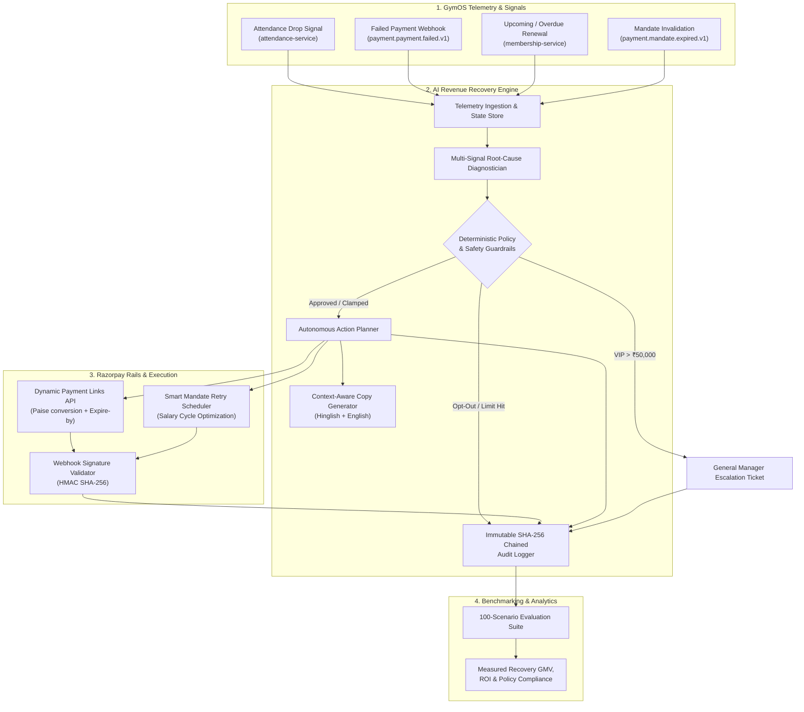

# System Architecture: GymOS AI Revenue Recovery Sentinel

## 1. Executive Summary & Design Principles

The **GymOS AI Revenue Recovery Sentinel** is an autonomous, bounded agentic system designed to detect, diagnose, and recover at-risk subscription and membership revenue for gym and fitness SaaS merchants.

Built specifically for **Razorpay Buildathon — Track 03 (AI Revenue Recovery)**, the architecture operates under four strict core principles:
1. **Explainable Financial Actions**: Every decision, reasoning path, and tool invocation is transparent and traceable.
2. **Deterministic Financial Guardrails**: The LLM / Agent is strictly bounded by hard-coded policy constraints (maximum 15% discount limit, max 3 touch attempts, mandatory cooling-off periods, and strict opt-out compliance).
3. **Multi-Signal Telemetry Fusion**: Combines real-time physical/digital behavioral telemetry (GymOS attendance drops, visit frequency decay) with payment transaction failure codes from Razorpay webhooks.
4. **Cryptographically Chained Audit Trail**: Maintains an immutable, SHA-256 chained event log recording every trigger, diagnosis, policy check, and Razorpay API execution.

---

## 2. High-Level System Architecture



---

## 3. Core Engine Components

### 3.1 Multi-Signal Root-Cause Diagnostician (`agent/diagnostician.py`)
Rather than treating all payment failures as a single bucket, the diagnostician decomposes revenue leakage into five distinct operational categories:

| Root Cause Category | Diagnostic Signals Matched | Recovery Strategy |
| :--- | :--- | :--- |
| **`TECHNICAL_BANKING_FAILURE`** | `BANK_SERVER_UNAVAILABLE`, `PAYMENT_TIMED_OUT`, active attendance | **Silent Smart Retry**: Automated retry in 4 hours on alternate gateway route. Zero merchant discount given. |
| **`INSUFFICIENT_FUNDS_TIMING`** | `INSUFFICIENT_FUNDS`, high historical lifetime value | **Salary Window Alignment**: Nudge scheduled for salary credit cycle (1st–5th of month) + direct Razorpay link. |
| **`SILENT_CHURN_DISENGAGEMENT`** | Inactive $>14$ days, attendance dropped $>65\%$ | **Reactivation Concierge**: Personalized Hinglish WhatsApp copy + bounded 10% loyalty reactivation discount. |
| **`CARD_MANDATE_EXPIRED`** | `MANDATE_EXPIRED`, `CARD_DECLINED` on recurring Autopay | **1-Click Dynamic Payment Link**: Instant Razorpay hosted payment link with 48h validity. |
| **`HIGH_VALUE_VIP_RISK`** | Membership amount $\ge$ ₹50,000 (Corporate / Annual) | **Human Escalation**: Generates high-priority CRM ticket for Gym General Manager. |

---

### 3.2 Deterministic Financial Guardrails (`agent/policy_guardrails.py`)
To prevent LLM hallucination and ensure merchant safety, financial constraints are executed in deterministic code:

```
                  ┌───────────────────────────────┐
                  │    Proposed AI Intervention   │
                  └──────────────┬────────────────┘
                                 │
                 [Opted-Out of Reminders?] ──────── Yes ──► [HARD STOP: BLOCKED_OPT_OUT]
                                 │ No
                 [Consecutive Touches >= 3?] ───── Yes ──► [HARD STOP: BLOCKED_MAX_TOUCHES]
                                 │ No
                 [GMV >= ₹50,000?] ─────────────── Yes ──► [ESCALATE_TO_MANAGER]
                                 │ No
                 [Proposed Discount > 15%?] ────── Yes ──► [CLAMP DISCOUNT TO 15.0%]
                                 │ No
                  ┌──────────────▼────────────────┐
                  │    APPROVED FOR EXECUTION     │
                  └───────────────────────────────┘
```

---

### 3.3 Cryptographic Audit Trail (`agent/audit_logger.py`)
Every decision step is recorded in an append-only ledger (`logs/audit_trail.jsonl`). Each record contains:
$$\text{Entry Hash} = \text{SHA256}(\text{Timestamp} + \text{MemberID} + \text{Diagnosis} + \text{Action} + \text{Previous Hash})$$

This creates a tamper-proof hash chain enabling auditor verification of zero policy violations and continuous system compliance.

---

## 4. Razorpay Rails Integration (`razorpay_client/`)

1. **Dynamic Payment Links API**: Converts amounts to paise, attaches customized metadata notes (`root_cause`, `member_id`, `discount_applied`), enables automated SMS/Email reminders, and enforces a strict `expire_by` epoch.
2. **Subscriptions / Smart Retries API**: Orchestrates recurring UPI Autopay / e-Mandate retry attempts based on calculated optimal time windows.
3. **Webhook HMAC SHA-256 Validation**: Re-computes cryptographic signature from request payload and secret before advancing internal recovery state.

---

## 5. Benchmark Methodology (`benchmark/`)
The engine is continuously verified against a **100-scenario synthetic dataset** spanning:
* 20% Technical gateway & bank timeouts
* 25% Insufficient funds & salary cycle lags
* 30% Silent churners with physical attendance drops
* 15% Invalidated UPI Autopay & card mandates
* 5% High-value corporate VIP accounts
* 5% Explicit opt-out compliance edge cases
