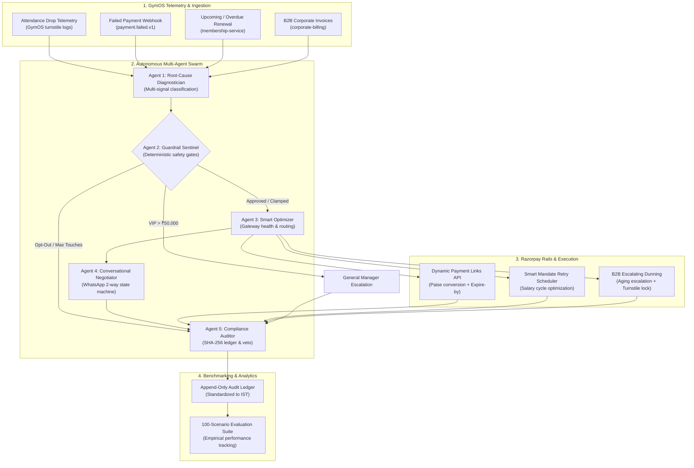

# System Architecture: GymOS AI Revenue Recovery Sentinel
### *Autonomous, Bounded Multi-Agent Swarm on Razorpay Rails*

---

## 1. Executive Summary & Design Principles

The **GymOS AI Revenue Recovery Sentinel** is an autonomous, bounded multi-agent system designed to detect, diagnose, negotiate, and recover at-risk subscription and membership revenue for gym and fitness SaaS merchants.

Built specifically for **Razorpay Buildathon — Track 03 (AI Revenue Recovery)**, the architecture is founded upon five strict core engineering principles:

1. **Multi-Signal Telemetry Fusion**: Fuses physical/digital behavioral telemetry (GymOS turnstile check-ins, attendance decay) with transactional payment failure codes from Razorpay webhooks.
2. **Deterministic Financial Guardrails**: The AI agents are strictly bounded by hard-coded merchant constraints (maximum 15% discount ceiling, max 3 touch attempts per cycle, mandatory 24h cooling-off periods, and strict opt-out compliance).
3. **Dynamic Two-Way Negotiation & Continuous Accounting**: Conversational state machine capable of parsing complex member intents (e.g. natural language freeze durations, salary delays) while maintaining continuous billing cycle integrity.
4. **Adaptive Gateway Health Routing**: Real-time gateway monitoring and automated failover away from degraded bank aggregators (e.g. HDFC outage $\rightarrow$ ICICI/Axis failover).
5. **Cryptographically Chained Audit Trail**: Append-only SHA-256 chained event log recording every trigger, diagnosis, policy check, and Razorpay API execution in Indian Standard Time (IST).

---

## 2. High-Level System Architecture & 5-Agent Swarm



---

## 3. Detailed Agent Swarm Specifications

### 3.1 Agent 1: Root-Cause Diagnostician (`agent/diagnostician.py`)
Classifies revenue leakage into 5 operational categories based on multi-signal fusion:

| Root Cause Category | Diagnostic Signals Matched | Recovery Strategy |
| :--- | :--- | :--- |
| **`TECHNICAL_BANKING_FAILURE`** | `BANK_SERVER_UNAVAILABLE`, `PAYMENT_TIMED_OUT`, active attendance | **Silent Smart Retry**: Automated retry in 4 hours on alternate gateway route. Zero merchant discount given. |
| **`INSUFFICIENT_FUNDS_TIMING`** | `INSUFFICIENT_FUNDS`, high historical lifetime value | **Salary Window Alignment**: Nudge scheduled for salary credit cycle (1st–5th of month) + direct Razorpay link. |
| **`SILENT_CHURN_DISENGAGEMENT`** | Inactive $>14$ days, attendance dropped $>65\%$ | **Reactivation Concierge**: Personalized Hinglish WhatsApp copy + bounded 10% loyalty reactivation discount. |
| **`CARD_MANDATE_EXPIRED`** | `MANDATE_EXPIRED`, `CARD_DECLINED` on recurring Autopay | **1-Click Dynamic Payment Link**: Instant Razorpay hosted payment link with 48h validity. |
| **`HIGH_VALUE_VIP_RISK`** | Membership amount $\ge$ ₹50,000 (Corporate / Annual) | **Human Escalation**: Generates high-priority CRM ticket for Gym General Manager. |

---

### 3.2 Agent 2: Deterministic Guardrail Sentinel (`agent/policy_guardrails.py`)
Enforces hard deterministic constraints before any action is executed:

```
                  ┌───────────────────────────────┐
                  │    Proposed AI Intervention   │
                  └──────────────┬────────────────┘
                                 │
                 [Opted-Out of Reminders?] ──────── Yes ──► [HARD STOP: BLOCKED_OPT_OUT]
                                 │ No
                 [Consecutive Touches >= 3?] ───── Yes ──► [HARD STOP: BLOCKED_MAX_TOUCHES]
                                 │ No
                 [GMV >= ₹50,000?] ─────────────── Yes ──► [ESCALATE_TO_MANAGER]
                                 │ No
                 [Proposed Discount > 15%?] ────── Yes ──► [CLAMP DISCOUNT TO 15.0%]
                                 │ No
                  ┌──────────────▼────────────────┐
                  │    APPROVED FOR EXECUTION     │
                  └───────────────────────────────┘
```

---

### 3.3 Agent 3: Smart Optimizer & Router (`razorpay_client/smart_optimizer.py`)
* Computes real-time **Success Rates (SR)** and latency across major bank aggregators (HDFC, ICICI, Axis, SBI).
* When a gateway's SR drops below the **70% health threshold**, the router dynamically shifts active traffic to the healthiest alternative gateway.

---

### 3.4 Agent 4: Conversational Negotiator (`agent/conversational_agent.py`)
* Manages stateful, two-way conversational recovery over WhatsApp.
* **Dynamic Natural Language Freeze Parsing**: Parses arbitrary freeze durations (e.g. `3 weeks -> 21 days`, `10 days -> 10 days`, `2 months -> 60 days`).
* **Continuous Subscription Cycle Anchoring**:
  When a member delays payment by $N$ days (grace period elapsed), the renewal anchor is computed as:
  $$\text{New Expiry Date} = \text{Payment Date} + (\text{Cycle Duration} - \text{Grace Days Elapsed})$$
  Ensures zero revenue leakage while maintaining member workout access.

---

### 3.5 Agent 5: Compliance Auditor (`agent/audit_logger.py`)
Maintains an append-only ledger (`logs/audit_trail.jsonl`). Each record contains:
$$\text{Entry Hash} = \text{SHA256}(\text{Timestamp} + \text{MemberID} + \text{Diagnosis} + \text{Action} + \text{Previous Hash})$$

* **Standardized Timezone**: Indian Standard Time (`Asia/Kolkata`, `+05:30`).
* **Opt-Out Veto**: Immediately terminates active dunning across all channels if a user sends opt-out keywords (`STOP`, `UNSUBSCRIBE`, `CANCEL`).

---

## 4. B2B Corporate Wellness Dunning (`agent/b2b_dunning.py`)

Escalates corporate wellness receivables across 4 structured aging tiers:
1. **Current (Days 0–15)**: Friendly payment reminder with consolidated Razorpay link.
2. **Warning (Days 16–30)**: Firm reminder with HR/Billing Manager notification.
3. **Critical (Days 31–45)**: Advance warning of scheduled employee gym turnstile suspension.
4. **Suspended (Days 46–60+)**: Turnstile access revoked + General Manager & Legal escalation.

---

## 5. Razorpay Rails Integration (`razorpay_client/`)

1. **Dynamic Payment Links API**: Converts amounts to paise, attaches customized metadata notes (`root_cause`, `member_id`, `discount_applied`), enables automated SMS/Email reminders, and enforces a strict `expire_by` epoch.
2. **Subscriptions / Smart Retries API**: Orchestrates recurring UPI Autopay / e-Mandate retry attempts based on calculated optimal time windows.
3. **Webhook HMAC SHA-256 Validation**: Re-computes cryptographic signature from request payload and secret before advancing internal recovery state.

