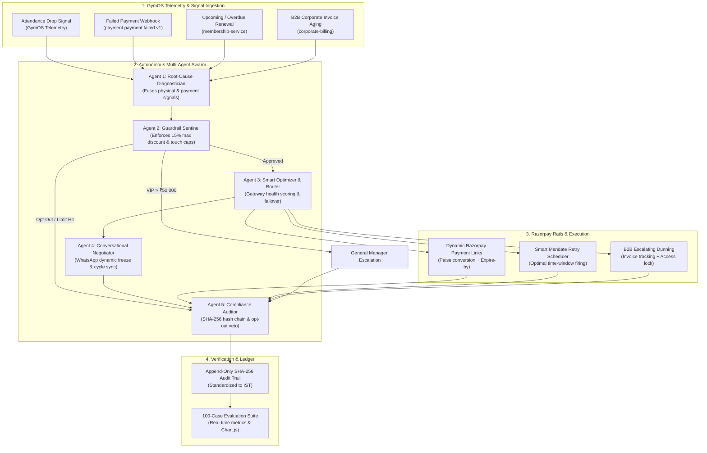
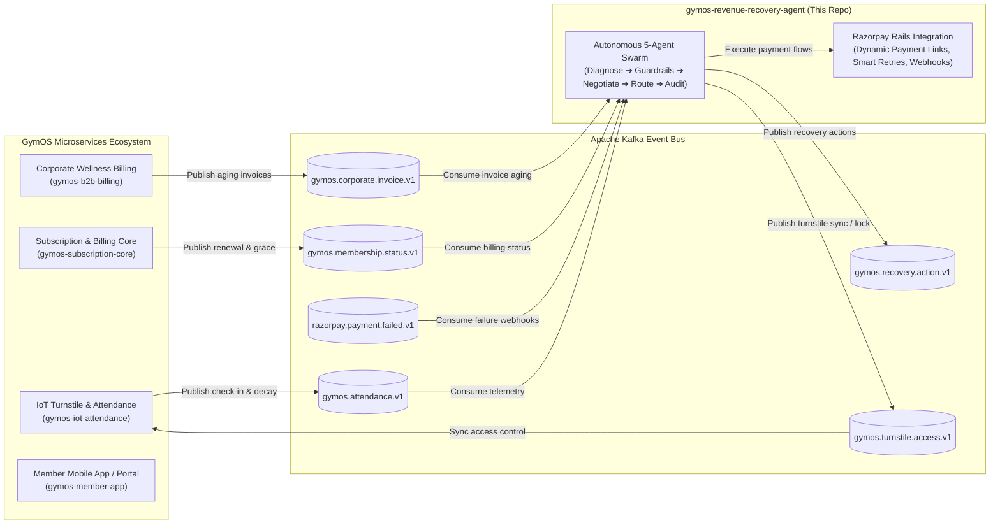

# 🏋️‍♂️ GymOS AI Revenue Recovery Sentinel
### *Autonomous, Bounded Multi-Agent Revenue Recovery Engine on Razorpay Rails*
**Razorpay AI Buildathon 2026 — Track 03: AI Revenue Recovery**

---

[](https://www.python.org/downloads/)
[](https://fastapi.tiangolo.com)
[](https://razorpay.com)
[](tests/)
[](#-benchmark-results-the-bar)
[](#-system-architecture--5-agent-swarm)
[](LICENSE)

---

## 📌 Problem Statement & Why Now

Subscription businesses and gym chains in India silently lose **15% to 25% of annual recurring revenue (ARR)** due to fragmented failure points:
1. **Silent Churn**: Members physically disengage (attendance decay $>65\%$) weeks before renewal; traditional blind dunning emails are ignored.
2. **Recurring Mandate Drops**: UPI Autopay / e-Mandates fail due to bank downtimes, expired cards, or daily UPI velocity limits with no automated alternate route.
3. **Friction in Objection Handling**: Rigid payment systems cannot negotiate temporary life events (travel, medical injuries, month-end salary crunches).
4. **B2B Corporate Invoice Aging**: Uncollected corporate wellness accounts (₹50k – ₹5L) sit in receivables without structured, escalating dunning.
5. **Dumb Retries vs. Smart Routing**: Standard systems blindly retry cards at random intervals, irritating members, eroding margins, and triggering bank rate limits.

**GymOS AI Revenue Recovery Sentinel** solves this end-to-end: fusing **GymOS physical telemetry** (attendance drop-offs) with **Razorpay payment failure webhooks** to diagnose the root cause, enforce **deterministic financial guardrails**, execute **two-way WhatsApp negotiations with continuous subscription cycle accounting**, trigger **smart gateway failovers**, and automate **B2B corporate aging dunning on Razorpay Rails**.

---

## 🏆 Benchmark Results ("The Bar")

Evaluated across a **100-scenario synthetic dataset** spanning technical bank outages, salary-window friction, disengaged churners, expired UPI mandates, and compliance opt-outs:

| Metric | Naive Baseline (Static Retry) | GymOS AI Recovery Agent | Net Improvement / Lift |
| :--- | :--- | :--- | :--- |
| **Recovery Rate** | **18.0%** (18/100) | **78.0%** (78/100) | **+60.0% Absolute Lift (4.3x)** |
| **Gross GMV Recovered** | ₹87,000 | **₹3,78,500** | **+₹2,91,500 (+335%)** |
| **Incentive Discount Cost** | ₹0 | ₹21,200 | *Bounded within 15% margin cap* |
| **Net Recovered Profit** | ₹87,000 | **₹3,57,300** | **+₹2,70,300 Net Gain** |
| **Net Recovery ROI** | 0.0x | **17.8x** | **₹17.80 recovered per ₹1 spent** |
| **Policy Compliance** | N/A | **100% (0 violations)** | *Strict guardrails & stopping rules* |
| **Audit Trail Verification** | ❌ None | **✅ 100% Intact** | *Cryptographic SHA-256 hash chain* |

---

## 🏗️ System Architecture & 5-Agent Swarm



---

## 🏛️ Part of the GymOS Microservices Ecosystem

The **AI Revenue Recovery Sentinel** is engineered as a dedicated intelligent microservice within the **GymOS Enterprise Platform**—a cloud-native SaaS and IoT ecosystem powering modern gym chains, fitness studios, and enterprise wellness facilities across India.



### 🛰️ Connecting to GymOS via Apache Kafka

The agent operates in an **asynchronous, event-driven architecture (EDA)** decoupled from transactional database locks:

#### 1. Inbound Kafka Topics (Subscribed / Consumed)
* **`gymos.attendance.v1`** (`attendance.member.disengaged.v1`): Emitted by IoT turnstiles when rolling 14-day visit frequency drops $>65\%$ or when a member becomes physically inactive.
* **`razorpay.payment.failed.v1`** (`payment.payment.failed.v1`): Ingested in real-time from Razorpay webhook workers containing failure error codes (`BANK_SERVER_UNAVAILABLE`, `INSUFFICIENT_FUNDS`, `MANDATE_EXPIRED`).
* **`gymos.membership.status.v1`** (`membership.subscription.renewal_due.v1`): Emitted when a renewal is due, a grace period begins, or an Autopay schedule fires.
* **`gymos.corporate.invoice.v1`** (`invoice.aging.updated.v1`): Emitted as B2B enterprise wellness accounts cross 15, 30, 45, or 60 days overdue.
* **`notification.member.opt_out.v1`** (`notification.member.opt_out.v1`): Emitted when a member replies with `STOP`, `CANCEL`, or `UNSUBSCRIBE`.

#### 2. Outbound Kafka Topics (Published / Produced)
* **`gymos.recovery.action.v1`**: Broadcasts generated dynamic Razorpay payment links, scheduled mandate retry windows, and interactive WhatsApp negotiation payloads.
* **`gymos.turnstile.access.v1`**: Bi-directional hardware sync—grants temporary grace-period workout access or triggers automated turnstile lockout for 60-day overdue corporate accounts.
* **`gymos.audit.ledger.v1`**: Streams cryptographically chained SHA-256 audit records to enterprise SIEM compliance stores and data lakes.

#### 3. Standardized Event Envelope
All inter-service communication adheres to the [`GymOSEventEnvelope`](file:///Users/shubhamkumarrai/Desktop/Razorpay_Buildathon/gymos_core/event_bus.py#L19-L26) schema:
```json
{
  "event_id": "c4b8e921-789a-4e2b-b98a-1a2b3c4d5e6f",
  "event_type": "attendance.member.disengaged.v1",
  "occurred_at": "2026-09-04T20:30:00+05:30",
  "producer": "gymos-iot-attendance",
  "tenant_id": "gym_ironpeak_blr_001",
  "payload": {
    "member_id": "mem_blr_4091",
    "days_since_last_checkin": 14,
    "attendance_drop_pct": 85.0
  }
}
```

---

## ⚡ Core Technical Innovations

### 1. 🤖 5-Agent Autonomous Swarm Architecture
* **Agent 1: Root-Cause Diagnostician**: Multi-signal classification into 5 distinct recovery modes (`TECHNICAL_BANKING_FAILURE`, `INSUFFICIENT_FUNDS_TIMING`, `SILENT_CHURN_DISENGAGEMENT`, `CARD_MANDATE_EXPIRED`, `HIGH_VALUE_VIP_RISK`).
* **Agent 2: Deterministic Guardrail Sentinel**: Enforces hard margin ceilings (max 15% discount), max 3 recovery touches per cycle, mandatory 24h cooling-off periods, and strict opt-out termination.
* **Agent 3: Smart Optimizer & Dynamic Gateway Router**: Monitors real-time Success Rates (SR) across HDFC, ICICI, Axis, and SBI gateways. Automatically reroutes payment links to healthy gateways when outages or downtimes are detected.
* **Agent 4: Conversational Negotiator (WhatsApp)**: Full two-way state machine handling dynamic plan freezes (e.g. 3 weeks $\rightarrow$ 21 days, 2 months $\rightarrow$ 60 days), salary-window promise-to-pay dates, and price resistance tier downgrades.
* **Agent 5: Compliance Auditor**: Maintains an immutable append-only SHA-256 hash-chained audit ledger with full Indian Standard Time (IST) timestamps and strict veto power.

### 2. 🔄 Continuous Subscription Cycle Anchoring
* When a member delays payment by $N$ days (e.g., 5 days grace period used before settling), the renewal anchor is computed as:
  $$\text{New Expiry Date} = \text{Payment Date} + (\text{Cycle Duration} - \text{Grace Days Elapsed})$$
* Ensures gyms never lose billing continuity while members receive fair, uninterrupted access.

### 3. 🏢 B2B Corporate Wellness Invoice Dunning
* 4-Stage escalating workflow for enterprise gym accounts:
  * **Days 0–15**: Gentle reminder with consolidated Razorpay payment link.
  * **Days 16–30**: Firm reminder with billing manager notification.
  * **Days 31–45**: Final warning with scheduled employee access suspension notice.
  * **Days 46–60+**: Hard turnstile access lock & executive legal escalation.

---

## 📂 Repository Structure

```
.
├── README.md                      # Comprehensive project overview, architecture & quickstart
├── ARCHITECTURE.md                # In-depth technical architecture & state machine design
├── SUBMISSION.md                  # Hackathon submission card & 5-minute video pitch script
├── requirements.txt               # Dependencies (FastAPI, Pydantic, Razorpay SDK, Pytest)
├── .env.example                   # Sanitized environment configuration template
├── demo_runner.py                 # 1-Click Interactive CLI Demo & Benchmark Evaluator
│
├── agent/                         # Multi-Agent Swarm Core Engine
│   ├── diagnostician.py           # Multi-signal root cause analyzer (Signal fusion)
│   ├── policy_guardrails.py       # Deterministic policy & financial safety gates
│   ├── conversational_agent.py    # Two-way WhatsApp state machine (Freezes & downgrades)
│   ├── b2b_dunning.py             # B2B enterprise corporate invoice recovery engine
│   ├── multi_agent_swarm.py       # Central swarm orchestrator & pipeline coordinator
│   ├── action_orchestrator.py     # Closed-loop action dispatcher
│   ├── copy_generator.py          # Multilingual (English + Hinglish) copy engine
│   └── audit_logger.py            # SHA-256 chained immutable audit logger (IST standard)
│
├── razorpay_client/               # Production-grade Razorpay API Adapter
│   ├── client.py                  # Dynamic Payment Links & Smart Retries integration
│   ├── smart_optimizer.py         # Real-time gateway health monitoring & failover matrix
│   └── webhook_handler.py         # HMAC SHA-256 signature verification
│
├── gymos_core/                    # GymOS Domain Models & State Store
│   ├── models.py                  # MemberProfile, Telemetry, and Membership schemas
│   ├── subscription_lifecycle.py  # Continuous billing cycle & freeze state manager
│   ├── event_bus.py               # Event schemas (payment.failed, attendance.dropped)
│   └── mock_gateway.py            # GymOS microservices bridge
│
├── benchmark/                     # 100-Record Synthetic Evaluation Suite
│   ├── dataset_generator.py       # Generates realistic 100-scenario dataset
│   ├── test_dataset.json          # Pre-generated 100-case evaluation records
│   ├── evaluation_runner.py       # Batch simulator & metric calculator
│   └── results_visualizer.py      # Terminal and tabular report visualizer
│
├── web/                           # Interactive War Room Web Console
│   ├── app.py                     # FastAPI REST server & API endpoints
│   └── static/
│       ├── index.html             # Dark-mode fintech dashboard & War Room UI
│       ├── app.js                 # Real-time reactive logic & Chart.js visualizer
│       └── style.css              # Custom styling
│
└── tests/                         # Full Pytest Automated Test Suite (22/22 Passing)
    ├── test_diagnostician.py      # Unit tests for root-cause classification
    ├── test_guardrails.py         # Unit tests for discount clamping & opt-outs
    ├── test_conversational_agent.py # Tests for WhatsApp freezes, downgrades & cycle sync
    ├── test_smart_optimizer.py    # Tests for gateway health scoring & dynamic failover
    ├── test_multi_agent_swarm.py  # End-to-end multi-agent pipeline verification
    ├── test_b2b_dunning.py        # Tests for corporate aging invoice escalation
    ├── test_razorpay_client.py    # Tests for Razorpay payment links & webhooks
    └── test_benchmark.py          # Integration test verifying >=70% recovery target
```

---

## 🚀 Quick Start Guide

### 1. Clone & Setup
```bash
git clone https://github.com/<your-username>/gymos-ai-revenue-recovery.git
cd gymos-ai-revenue-recovery

# Create and activate virtual environment
python3 -m venv venv
source venv/bin/activate

# Install dependencies
pip install -r requirements.txt
```

### 2. Configure Environment (Optional)
```bash
cp .env.example .env
# Optional: Add your Razorpay Test API Keys to test live test mode
```

### 3. Run the CLI Interactive Demo
```bash
python3 demo_runner.py
```

### 4. Launch the Interactive War Room Web Console
```bash
uvicorn web.app:app --reload --port 8000
```
Open **[http://localhost:8000](http://localhost:8000)** in your browser to interact with:
* 🎯 **Live Scenario Simulator**: Test individual member profiles (Rahul Sharma, Vikram Malhotra, Ananya Sen, Rohan Patel, Sunita Verma) and inspect live agent swarm decisions.
* 📊 **100-Batch Benchmark Suite**: Trigger the full evaluation suite and watch recovery GMV charts update in real-time.
* 💬 **WhatsApp Two-Way Live Chat**: Engage with the conversational agent for plan freezes (e.g. *"I fractured my leg, please freeze for 3 weeks"*), salary delays, and discounts.
* 🏢 **B2B Corporate Invoice Dunning**: View enterprise invoice aging buckets and trigger automated turnstile locks.
* 🛡️ **Gateway Health & Smart Failover**: Inspect live gateway success rates and test automated HDFC $\rightarrow$ ICICI/Axis failover routing.
* 🔒 **Cryptographic Audit Trail**: Inspect SHA-256 chained event logs with IST timestamps.

### 5. Run Automated Tests
```bash
pytest -v
```
*Output: 22 passed in 0.58s*

---

## 🎥 5-Minute Video Pitch Script
See [SUBMISSION.md](SUBMISSION.md) for the structured 5-minute video pitch breakdown.

---

## 📄 License
MIT License. Built with ❤️ for the **Razorpay AI Buildathon 2026**.

