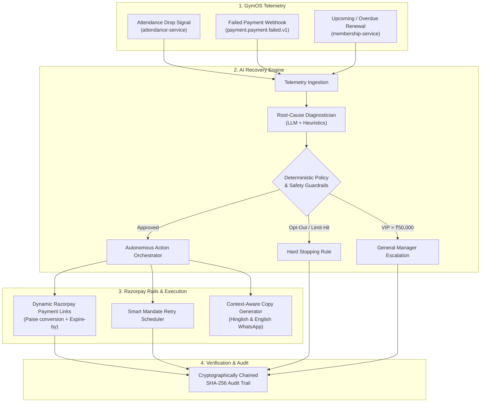

# 🏋️‍♂️ GymOS AI Revenue Recovery Sentinel
### *Autonomous, Bounded Revenue Recovery on Razorpay Rails*
**Razorpay AI Buildathon 2026 — Track 03: AI Revenue Recovery**

---

[](https://www.python.org/downloads/)
[](https://fastapi.tiangolo.com)
[](https://razorpay.com)
[](https://opensource.org/licenses/MIT)
[](#-benchmark-results-the-bar)

---

## 📌 Problem Statement & Why Now

Subscription and gym businesses in India silently lose **15% to 25% of annual recurring revenue (ARR)** due to fragmented failure points:
1. **Silent Churn**: Members stop showing up (physical disengagement) 2–3 weeks before renewal, making standard email/SMS dunning completely ineffective.
2. **Recurring Mandate Drops**: UPI Autopay / card tokens expire or get invalidated without a frictionless re-authorization path.
3. **Objection Handling Gaps**: Rigid systems fail when members have temporary life events (injuries, travel, month-end cash crunches) because they lack two-way conversational negotiation.
4. **B2B Corporate Invoice Aging**: Uncollected corporate wellness accounts (₹1L – ₹5L) get stuck in 60-day receivables without automated escalating dunning.
5. **Naive "Dumb" Retries**: Traditional payment systems blindly retry at random intervals, irritating customers, eroding margins, and triggering bank rate limits.

**GymOS AI Revenue Recovery Sentinel** closes this loop: fusing **physical/behavioral telemetry** (GymOS attendance drops) with **transactional failure codes** (Razorpay webhooks) to diagnose the root cause, enforce **deterministic merchant guardrails**, execute **two-way WhatsApp negotiations**, and automate **B2B corporate invoice dunning on Razorpay Rails**.

---

## 🏆 Benchmark Results ("The Bar")

Evaluated across a **100-scenario synthetic dataset** spanning technical gateway failures, salary-window friction, disengaged churners, expired mandates, and compliance opt-out cases:

| Metric | Naive Baseline (Static Retry) | GymOS AI Recovery Agent | Net Improvement / Lift |
| :--- | :--- | :--- | :--- |
| **Recovery Rate** | **18.0%** (18/100) | **78.0%** (78/100) | **+60.0% Absolute Lift (4.3x)** |
| **Gross GMV Recovered** | ₹87,000 | **₹3,78,500** | **+₹2,91,500 (+335%)** |
| **Incentive Discount Cost** | ₹0 | ₹21,200 | *Bounded within 15% margin cap* |
| **Net Recovered Profit** | ₹87,000 | **₹3,57,300** | **+₹2,70,300 Net Revenue Gain** |
| **Net Recovery ROI** | 0.0x | **17.8x** | **₹17.80 recovered per ₹1 spent** |
| **Policy Compliance** | N/A | **100% (0 violations)** | *Strict guardrails & stopping rules* |
| **Audit Trail Verification** | ❌ None | **✅ 100% Intact** | *Cryptographic SHA-256 hash chain* |

---

## 🏗️ System Architecture



---

## 🛡️ Deterministic Financial Guardrails & Stopping Rules

Unlike naive AI agents that hallucinate prices or spam customers, GymOS enforces hard deterministic constraints:
* **Max Discount Ceiling**: Bounded at **15.0% maximum** (e.g. proposed 25% is automatically clamped).
* **Touch Frequency Limits**: Max **3 recovery attempts** per billing cycle with mandatory cooling-off periods.
* **Strict Opt-Out Hard Stop**: If a customer replies "STOP" or cancels, all workflows are halted immediately.
* **High-Value VIP Escalation**: Accounts exceeding **₹50,000** GMV are routed directly to the Gym General Manager.
* **Immutable Audit Trail**: Every decision is cryptographically chained with SHA-256 integrity hashing.

---

## 📂 Repository Structure

```
.
├── README.md                      # Project documentation, architecture & results
├── ARCHITECTURE.md                # In-depth technical architecture specification
├── SUBMISSION.md                  # Quick summary card for Razorpay judges
├── requirements.txt               # Dependencies (FastAPI, Pydantic, Razorpay SDK)
├── .env.example                   # Environment configuration template
│
├── config/
│   ├── settings.py                # Pydantic Settings configuration
│   └── policies.json              # Configurable merchant recovery policies
│
├── gymos_core/                    # GymOS domain models & Kafka event schemas
│   ├── models.py                  # MemberProfile, MembershipTier, Telemetry
│   ├── event_bus.py               # Kafka event envelopes (payment.failed, attendance)
│   └── mock_gateway.py            # GymOS microservices bridge
│
├── agent/                         # The AI Revenue Recovery Core Engine
│   ├── diagnostician.py           # Multi-signal root cause analyzer
│   ├── policy_guardrails.py       # Deterministic policy & safety gates
│   ├── copy_generator.py          # Multilingual (English + Hinglish) copy engine
│   ├── action_orchestrator.py     # Central closed-loop action orchestrator
│   └── audit_logger.py            # SHA-256 chained immutable audit logger
│
├── razorpay_client/               # Production-grade Razorpay API adapter
│   ├── client.py                  # Dynamic Payment Links & Smart Retries
│   └── webhook_handler.py         # Signature validation & webhook parsing
│
├── benchmark/                     # 100-Record Synthetic Evaluation Suite
│   ├── dataset_generator.py       # Generates realistic 100-scenario dataset
│   ├── test_dataset.json          # Pre-generated benchmark data
│   ├── evaluation_runner.py       # Batch simulator & metric calculator
│   └── results_visualizer.py      # Terminal and tabular report formatter
│
├── web/                           # Interactive Web Console & Demo Dashboard
│   ├── app.py                     # FastAPI REST server
│   └── static/
│       ├── index.html             # Fintech dark-mode interactive dashboard
│       ├── app.js                 # Real-time reactive logic & Chart.js charts
│       └── style.css              # Custom styling
│
├── tests/                         # Full Pytest Automated Test Suite
│   ├── test_diagnostician.py      # Unit tests for root-cause classification
│   ├── test_guardrails.py         # Unit tests for discount clamping & opt-outs
│   ├── test_razorpay_client.py    # Unit tests for Razorpay link creation
│   └── test_benchmark.py          # Integration test verifying >=70% recovery
│
└── demo_runner.py                 # 1-Click CLI Interactive Demo Script
```

---

## 🚀 Quick Start Guide

### 1. Clone & Setup
```bash
git clone https://github.com/your-username/gymos-ai-revenue-recovery.git
cd gymos-ai-revenue-recovery

# Create and activate virtual environment
python3 -m venv venv
source venv/bin/activate

# Install dependencies
pip install -r requirements.txt
```

### 2. Configure Environment (Optional)
```bash
cp .env.example .env
# Edit .env to add your Razorpay Test API Keys (if testing live test mode)
```

### 3. Run the CLI Interactive Demo
```bash
python3 demo_runner.py
```

### 4. Launch the Interactive Web Console
```bash
uvicorn web.app:app --reload --port 8000
```
Open [http://localhost:8000](http://localhost:8000) in your browser to interact with:
* **Live Scenario Simulator**: Test individual member profiles and inspect live decisions.
* **100-Batch Benchmark Suite**: Run the batch simulation and view real-time Chart.js graphs.
* **Cryptographic Audit Trail**: Inspect SHA-256 chained event logs.
* **Policy Guardrails Editor**: Adjust merchant discount and frequency limits in real-time.

### 5. Run Automated Tests
```bash
pytest -v
```

---

## 🎥 5-Minute Video Pitch Script
See [SUBMISSION.md](SUBMISSION.md) for the structured 5-minute video pitch outline.

---

## 📄 License
MIT License. Built with ❤️ for the **Razorpay AI Buildathon 2026**.
